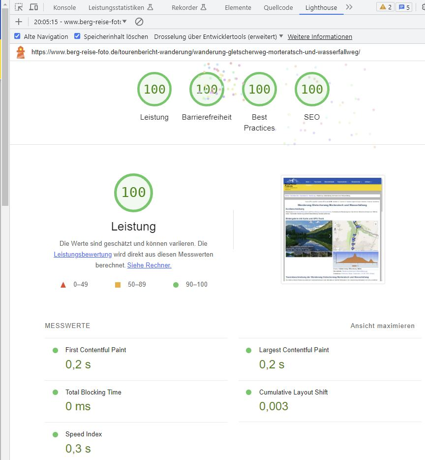

# Contents

- [Description](#Description)
- [Usage for those in a hurry](#usage-for-those-in-a-hurry)
- [Donate](#donate)
- [Live Example or Demo](#live-example-or-demo)
- [Note prior to installation](#note-prior-to-installation)
- [Installation](#installation)
- [Update or De-Installation](#update-or-de-installation)
- [Upgrade Notice](#upgrade-notice)
- [Usage](#usage)
- [Image Preparation and Usage of the Fotorama-Slider](#image-preparation-and-usage-of-the-fotorama-slider)
- [Usage of Leaflet Elevation](#usage-of-leaflet-elevation)
- [Tile Server for Leaflet Map Tiles](#tile-server-for-leaflet-map-tiles)
- [Frequently Asked Questions](#frequently-asked-questions)
- [Translation, i18n](#translation--i18n)
  * [Frontend](#frontend)
  * [Backend](#backend)
- [Credits](#credits)
- [Note for Developers](#note-for-developers)
- [Changelog](#changelog)

# Description 

**STATUS** The upload to the WordPress Plugin directory is still pending.

WordPress-Plugin to show a responsive Image Slider with images located in a separate FOLDER on your server or even in the WordPress Media Library. A thumbnail bar could be shown together with the image slider. Fotorama or Swiper is used for the slider. The Fotorama slider only works with JPG- or WEBP-Files an not with videos. Swiper works with Videos, too.

**NEW** Show a simple Masonry Gallery with your images from a dedicated Folder! Use only once per page if you like the info popup window.

Optionally a Leaflet map is shown. This map shows the GPS-position of the images and additionally a GPX-Track that was recorded during the excursion (leaflet elevation is used for that). The map moves synchronously to the slider, e.g. it is centred to the GPS-Position of the currently shown image. Under the map a height-chart of the GPX-track with its statistics is shown. The image slider may be used more than once per page. 

The Plugin is fully responsive (lazy loading, srcset if images are in WP-MediaLibrary) and SEO-friendly. It adds the images optionally to the Yoast-XML-Sitemap (Currently not tested!) and sets the alt-tag of the images. It is possible to use either the image-slider or the map with height-chart alone. Or the map alone with a simple marker. An Image zoom is provided in fullscreen mode for Fotorama (desktop only) and in the slider for Swiper. With Swiper Slider the images may be shown in fullscreen mode with **Simple Lightbox with fslight** (another plugin from me, available as WP-Plugin: https://de.wordpress.org/plugins/simple-lightbox-fslight/)

If resized images and thumbnails are available in the folder, the responsive image srcset is used. If the images were added to WP-Media-Library the WordPress-information of the Media-Library is used for the title and the alt-tag.  

The Plugin sets additionally the custom-fields 'lon' and 'lat' of the post where the slider is used. This are the longitude and latitude of the first image or track-point. This coordinates are used by another plugin from me to show all posts in a map. See here: https://github.com/MartinvonBerg/wp_post_map_view_simple. Additionally it sets the start address of the excursion in a custom field an shows under the map with a link to google-maps to retrieve the route to the starting point. Attention: The server-setting 'allow_url_fopen' has to be 'ON' for this to work.

The Admin panel gives an overview of all shortcode parameters and allow to set them globally. Settings that have to be set individually for each slider are not provided in the Admin panel. The admin panel provides also an upload section for gpx-files with additionally size and point reduction and statistics calculation. 

**NEW:Settings may be done with a Gutenberg Block. But Version 0.16.+ not updated yet!!!** also (except: "showalltracks", "mapcenter", "zoom", "markertext"). But there is NO preview in Editor, it is still necessary to refresh the page on the frontend. Attention: Gutenberg is currently not up to date.

**The Plugin runs from WordPress 5.9 - 6.4.x and PHP 7.4.2 - 8.2.0**

</br>

# Usage for those in a hurry
- Install current **Release** of the Plugin and activate.
- Do all global, common settings for the plugin: Wordpress > Login to Admin > Settings > Slider-Map-Chart
- Upload photos to e.g. "usr/www/html/wordpress/wp-content/uploads/holiday2021/"
- Add this shortcode to post: [gpxview imgpath="holiday2021"] if photos **do have GPS-Data**.
- Add this shortcode to post: [gpxview imgpath="holiday2021" requiregps="false" showmap="false"] if photos **don't have GPS-Data**.
- Done!

# Donate
If you like this plugin buy me a coffee or a beer:

[](https://www.paypal.com/cgi-bin/webscr?cmd=_s-xclick&hosted_button_id=CQA6XZ7LUMBJQ)

</br>    

# Live Example or Demo
See under https://www.berg-reise-foto.de/tourenbericht-skitour/skitour-auf-den-sextner-stein-in-sudtirol/
or any other travel or tour report on my page.

## Screenshot


# Performance
It is possible to reach a Google lighthouse Performance of 100 for the all values (Swiper only)! All values depend on the selected WordPress theme and server performance, too. Other settings : Please contact me, if you are interested.



# Note prior to installation
The Plugin works together with "Asset Clean up" (https://wordpress.org/plugins/wp-asset-clean-up/ ). 
- I did not test other Plugins for Code-Optimization like Autooptimize or anything else. 
- The plugin was tested with wordpress versions 5.9 - 6.2.2 and PHP 7.4.2 - 8.2.0

# Installation

0. Do a complete Back-up of your WordPress-Site including SQL-Database!
1. **! Important !** Download the plugin as **Release** from github to a local *.zip - file.
2. Install the zipped Plugin to the WordPress-Plugin-Page (Upload zip in Admin-Backend). 
3. Activate the plugin through the 'Plugins' menu in Admin-Area of WordPress
4. The Admin settings are initialised with reasonable values. Change the settings in the "Fotorama-Elevation" page for preferred settings.
5. Done!

# Update or De-Installation

**NEW** : Save your plugin-settings to a JSON File on your local machine for later use e.g. if you want to deinstall the plugin for testing purposes. After that:

1. Deactivate the plugin in Admin-Area of WordPress.
2. Optional if you use the Map-Tile-Server: save your .htaccess file from the plugin directory. Otherwise changes will be lost.
3. Optional for clean Update: Delete the Plugin-in. Stop here for De-Installation. Hint: The WordPress-Database is cleaned upon de-installation. The Custom-Fields are removed from your database! So, all settings are lost!
4. Do Installation with the new version. WordPress will provide you a message window wether you are sure. If you de-installed before, all settings have to be done again. Skip Step 3. and you don't have to do that. But mind to install in the same directory. This works only if you always install from a release OR the downloaded zip.

# Upgrade Notice 

Upgrade to WordPress 6.4 and PHP 8.1+ is highly recommended! PHP 8.1.x is even better!
Due to the error corrections it is highly recommended to upgrade the Plugin to 0.18.x! Thank's for your patience. With version update to 0.15.x all settings have to be done once again. But only once. Sorry for that! This won't be the case for future updates!

</br>

# Usage Hints

- Image and GPX-track preparation: see below, but mind that this part of the readme is not completely up to date.
- Shortcode:  `[gpxview]`   **Use the shortcode as often you want per page or post! No interference between shortcodes.**
- Parameters of the shortcode: <em>Parameter="Value"</em>. See the table in Admin-Settings for the parameters. Separate the parameters by at least one space between.
- NOTE: It is NOT required to provide ALL parameters! You only have to provide parameters that should be different to the common admin settings, or where no admin setting is available.
- Example minimal Shortcode: `[gpxview imgpath="galleries/holiday2021"]`
- Example complete Shortcode: `[gpxview imgpath="Alben_Website" gpxpath="gpx" gpxfile="test.gpx" showalltracks="false" mapheight="400" chartheight="200" dload="true" alttext="" ignoresort="false" useCDN="false" showadress="true" showmap="true" adresstext="Start address" requiregps="true" maxwidth="1500" minrowwidth="480" showcaption="true" eletheme="lime-theme" mapcenter="48.12,12.35" zoom="8" markertext="My Address"]`

- **ATTENTION** There are Admin Settings without parameter in the shortcode:
    - All Settings for GPX-File upload.
    - Add Permalink: Add a Permalink to the attachment page of the Image. AND add the permalink to the sitemap instead of the image link.
    - Set Custom Fields for post: Set Custom Fields (geoadress, lat, lon, postimg) in post. Geoadress is for the start address shown under the elevation chart. Lat., Lon. are for the GPS-Coords used for the Overview-Map. The custom-fields *lat*, *Lon*, *postimg* and *geoadress* are only set ONCE at the status-transition from 'draft' to 'published' only. So, if you want to change do 'published' to 'draft' to 'published' again. The data is taken from the FIRST shortcode on the page or post, only. So the images have to provide GPS-data or a GPX-track has to be used for this FIRST shortcode.
    - Generate Entries in Yoast XML-Sitemap for Fotorama Images: Generate the Entries for the Yoast XML-Sitemap with the images shown in the Fotorama-Slider. Used for SEO. Entries are stored in Custom field `postimg`. Currently not Tested! The custom field is only written if `Set Custom Fields` is checked (="true") and if the admin user is logged in. The status change is no longer required. Only usefull if you use Yoast SEO plugin. 
    

- **ATTENTION** And there are shortcode parameters without Admin Settings, which is now only visible after Plugin installation in the parameters tab.

</br>

## Usage of the admin section 'GPX-File'

### Explanation in the order of appearance:
- Path to GPX-Files: Set the path where you store your files. Recommended to set it once only
- GPX-File: Select a GPX-File from your disk you want to upload.
- GPX-Parsing: If checked the file will be reduced to the absolute minimum that is necessary to show a track in the leaflet map. Useful to reduce network load and speed up the page.
- Ignore Track Points with Zero Elevation: Uncheck, to parse tracks which are taken on sea level, or close to it.
- Distance Smooth: Add the track point only if it is XX meters away from the last track point (here 25m).
- Elevation Smooth: Min. Elevation between Track-Points in Meters. Used in Statistics Calc only. Best is 4.
- Overwrite GPX-Track: Well, self explanatory.
- Button "Save GPX-File" : Save the settings GPX-File upload and / or the file itself!
- NOTE to parameter 'showalltracks': It is required to use the above setting 'GPX-Parsing' activated for showalltracks to work.  

Process and save the file with the Button at the bottom.

</br>

# Image Preparation 
1. Preparation of Images (optional)
    - Generate Thumbnails and rescale your Images.
    I used "ImageResizer for Windows" rescaled the former full-size images and generated thumbnails. The Thumbnails have to have '_thumb', '-thumb', '200x150' or '150x150' in their filename (e.g. image1-thumb.jpg). The minimum size should be 64 x 64px. Best is 150 x 150px.
    Optionally you can store the Thumbnails to a subfolder './thumbs' but that is not required.
    If you do not provide thumbnails the full-scaled images will be used. This will increase load time significantly.

2. Preparation of Videos for Swiper
    - Videos require a small preview image for the thumbnail bar. Prepare this like the other thumbnails. Name it "video-1_thumb.jpg" (Where "video-1" could be any name for your video file).
    - Videos should have a "poster" to be shown as preview in the slider. It is required if you want to show the videos on the map. Prepare this poster with GPS-Data like you prepare other fotos for the slider. Name it "video-1_poster.jpg" (Where "video-1" could be any name for your video file).

3. Convert JPGs to WEBPs (optional) 
    To drastically reduce disk-space and download times you may use webp files. I do that conversion locally on my computer and do NOT used WP for that. I use Imagemagick for that with the following powershell commands:

    ```bat
    $files = Get-ChildItem ./*.jpg
    foreach ($f in $files) { magick ($f.BaseName + ".jpg") -quality 50 -define webp:auto-filter:true ($f.BaseName + ".webp") }
    ```

    Although the quality is set to 50 percent I can't see any significant difference.

    **Note:** Currently (as of 2021-07-17) WP does NOT extract metadata from WEBP-images. So, currently the most effective way to handle WEBP-images is to upload them as JPEGs and let WP convert all subsizes to *.webp. That could be done with the following code in your `functions.php`:

    ```php
    add_filter( 'image_editor_output_format', function( $formats ) {
	    $formats[ 'image/jpeg' ] = 'image/webp';
	    return $formats;
	    } 
    );
    ``` 

4. Upload images with ftp (FileZilla) or even Lightroom!
    - Upload the images from Step 1 to your WordPress site e.g. with Filezilla. Upload to the Sub-Folder `imgpath` (see table above) to 
./wp-content/uploads/. `imgpath` could be any allowed folder name. BUT: Do not use the WP-standard folders, like ./wp-content/uploads/2020/12 or ./wp-content/uploads/2021/Bilder_1 or so. This won't work.
        - Example:  ./wp-content/uploads/All_Albums/gallery1
    - Do not use 'thumb' or something like '4x5' or 200x150 or 150x150 (used regex: [0-9]x[0-9]) in the filename for the full-sized image. These files will be regarded as thumbnail and therefore ignored for the slider.
    
    Optionally:
    - **NEW:** Give your images files set a unique filename like 'Great-holidays-Italy-*number*' where *number* is a sequential number. Upload images to your WordPress Media Library with Standard upload. User the filefilter parameter to filter these files from your WordPress Standard Folder : *folder="2023/02" filefilter="Great-holidays-Italy-"*
    - Add the images to the WordPress Media Library with my other plugin: https://wordpress.org/plugins/wp-wpcat-json-rest/ See there for the manual how to do that.

    - If the images were 
        - added to the Media-Catalog of WordPress or added together with thumbnails (see above) the 'srcset' is used for thumbnails.
        - Note: Only with 'srcset' the small icon on the leaflet map shows the thumb for the image on hover.
        - Note for Lightroom-Users: I also wrote a Lightroom-Plugin to upload the images directly to the WordPress-Catalog and do the whole process in one Click! All image-work, updates, change of title, development can be done in Lightroom and the same image with unchanged WordPress-ID is updated. The images in the fotorama-slider are updated automatically. Mind that ALL caches on the line from the server to your browser have to emptied for that. If you use a Plugin to convert jpg to webp the cache of this plugins must be emptied to show changed images in the slider. 
    - Example-Folder

        

5. Add the shortcode to your page or post (see above for the shortcode)
    If EXIF-Data for the caption is not provided it will be replaced by "--"   
    
6. TODO & Bugs w.r.t to FOTORAMA
    - mixture of images with and without GPS-data and the option showmap="true" and requiregps="false" causes JS-errors. No standard use case. User should set showmap="false" for that case.
    - for images without thumbnail the hover on the map is wrong, pointing to a non existing image. 

# Usage of Leaflet Elevation
1. Preparation  (optional)

    Resize the GPX-Tracks with GPSBabel in a Batch-File (Windows-code):
    ```bat
    FOR %%i In (*.gpx) do GPSBabel -i gpx -f %%~i -x simplify,count=100 -o GPX -F %%~ni.gpx 
    ```
    The number of trackpoints is set by count (My File: GPS_Babel_GPX_Reduce.bat).
    Or reduce during upload as described above.
    

2. Upload GPX-Tracks
    - Upload the Tracks to the folder  ./wp-content/uploads/gpx with ftp. 
    - Or upload with the admin panel as described above.
    - The Folder "gpx" can be chosen relative to "../wp-content/uploads/" with the parameter [gpxview ...gpxpath="*path-to-gpx*"]. 
         Do not use (Back)-Slashes ('/' or '\\')  at the beginning or end of *path-to-gpx*.

3. Usage
    - see above.
      

# Tile Server for Leaflet Map Tiles
Since version 0.12.0, it is also possible to cache the leaflet tiles locally on your own server. This procedure conforms to the guidelines of the osmfoundation (https://operations.osmfoundation.org/policies/tiles/). There is no bulk download and the maps are stored locally. The Http referrer of the current request is used as the Http referrer. 
In addition the visitor's IP is NOT forwarded to the map server. This ensures that the use of maps from OpenStreeMap complies with the General Data Protection Regulation EC 2016/679. Therefore, no notice is required in the privacy policy of the website. This option can be set via the admin panel. Furthermore, the conversion of the tiles into webp file format can be selected in order to meet Google Pagespeed requirements.
Note: The file .htacces has to be changed for the correct path and the admin panel will show if the Redirection by the .htaccess is successful:
```PHP
    ... content of .htaccess in ../fotorama_multi/leaflet_map_tiles
    # Change only the next according to your server 
    RewriteBase /wordpress/wp-content/plugins/fotorama_multi/leaflet_map_tiles/
    # Do not change after this line
```
Drawback: No fileage clean-up implemented. So, once stored, the tiles are used forever. Currently, only a manual deletion works which forces a new download of the tiles. 

# Frequently Asked Questions

- Why is the Start address not shown? 
    - Check whether the custom fields *lat*, *lon*, *geoadress* are set. Use the WordPress-Plugin https://www.admincolumns.com/ for that. **Important:** The server-setting *allow_url_fopen* has to be *ON* or *'1'* for that! The plugin give you a message instead of the Start Address if you are logged in as Admin. 
- My YOAST sitemap is broken. What can I do?

    This happens occasionally if you are using many images in posts or pages. Due to that the generated XML-Code gets too long.
    Add this code to your functions.php and choose a reasonable number, e.g. 20.:
    ```PHP
        /* Limit the number of sitemap entries for Yoast SEO */
        function max_entries_per_sitemap() {
            return 20; // choose a reasonable number here
        }

        add_filter( 'wpseo_sitemap_entries_per_page', 'max_entries_per_sitemap' );
    ```

# Translation, i18n
## Frontend
All (available) strings are translated from English to German, Italian, French and Spanish. 'Available' means that some tooltips of leaflet-map are not translatable. You may find the translation in the file 'fotorama_multi.js' in the function `setlang()`. Change it or add your language, if you like so. To add your language just add another array like this:
```JS
let it = {
                'Show all' : "Mostra Tutti",
                'Distance' : "Distanza",
                "Ascent"   : "Salita",
                "Descent"  : "Discesa",
                "Altitude" : "Altitudine", // is in file /src/altitude.js
                "Images"   : "Foto",
                'Show fullscreen' : 'Mappa a schermo intero',
                'Exit fullscreen' : 'Esci schermo intero',
            };
```
Choose you language as array-name similar to `it` here. Mind that you have to 'activate' your translation in that line of code:
```JS
if ( (lang == 'de') || (lang == 'it') || (lang == 'fr') || (lang == 'es') ) {
```
The language setting is done in the browser of the client. So, there are no *.po or *.mo files.
I also provided a translation for the PHP-strings 'Start address' and 'Download' underneath the map. Unfortunately, I realized too late, that this is useless if the page is cached. 

## Backend
The translation of the backend was started partially only. A small part of the GPX-section is translated to german. The remainder not! That's quite a work. 

</br>

# Credits 
This plugin uses the great work from:

- fotorama, see: https://fotorama.io/ Thank you for that!
- leaflet: https://leafletjs.com
- Leaflet-elevation: https://github.com/Raruto/leaflet-elevation Thank you Raruto for your help!
- leaflet.Control.Fullscreen: https://github.com/brunob/leaflet.fullscreen
- leaflet gesture handling: https://github.com/elmarquis/Leaflet.GestureHandling/
- leaflet markercluster: https://github.com/Leaflet/Leaflet.markercluster
- d3.js: https://github.com/d3/d3
- extended ui: Copyright (c) 2020, GPL-3.0+ Project, Gérald Niel, Raruto
- gpx.js: Copyright (C) 2011-2012 Pavel Shramov, Copyright (C) 2013-2017 Maxime Petazzoni <maxime.petazzoni@bulix.org>
- wordpress for coding hints: https://de.wordpress.org/
- jquery.zoom.js from: http://www.jacklmoore.com/zoom
- phpGPX library: https://github.com/Sibyx/phpGPX
- HTML Table generator: https://www.tablesgenerator.com/html_tables
- WordPress Option Page generator from http://jeremyhixon.com/wp-tools/option-page/
- icons from freeicons.io
- mapicons from https://mapicons.mapsmarker.com/
- https://onlinepngtools.com/ for adaptation of the PNG-icons
- OpenStreetMaps, OpentTopoMaps  are great services.
- Nominatim for reverse geo-coding: https://nominatim.org/release-docs/develop/api/Reverse/
- MediaWiki for the PHP-Code to extract EXIF-Meta from Webp images (https://doc.wikimedia.org/mediawiki-core/1.27.3/php/WebP_8php_source.html)
- Swiper.js Slider: Great! Thank you for that: https://swiperjs.com/
- MiniMasronry js Gallery: Simple, fast and good performance: https://github.com/Spope/MiniMasonry.js/

# Note for Developers
- unit tests
    - Meaningful tests with PHPunit and BrainMonkey are done. Meaningful means that functions / methods that would have needed mock-ups to a great extent were not tested. Means that functions that make use of lots of or sophisticated WP-functions are not tested. Testing these would require the re-design of WP-functions in BrainMonkey what is simply not efficient and useful.
- integration tests
    - done on my local test suite and on my live site 
- system tests
    - done on my local test suite and on my live site
    - I'm using an external Python script with selenium to "click" through all pages and posts, capture all error messages and warnings, do screen shots and compare these automatically with previous versions and compare  html-sources with previous sources. Quite useful a automated test to detect hidden errors.
    - interference with other plugins:
        - All PHP code runs in separate namespaces
        - JS is wrapped in a self invoking function call and only executed if the dedicated div-id is found on the page.
        - CSS might be a problem, as I did not us SCSS, CASS or less to generate really separated CSS-classes.
        - I'm using the following plugins on my site: (output of the REST-API to list all plugins)
        ```JSON
        [
            {"name":"Admin Columns"}, 
            {"name":"Antispam Bee"},
            {"name":"Asset CleanUp: Page Speed Booster"}, // This is extensively used to unload unused plugin code!
            {"name":"Cache Enabler"},
            {"name":"Duplicate Page and Post"},
            {"name":"Easy Table of Contents"},
            {"name":"Ext_REST_Media_Lib"}, // Plugin from me
            {"name":"Fotorama-Multi"}, // Plugin from me
            {"name":"Gmedia Gallery"},
            {"name":"Gutenberg"},
            {"name":"WebP Express"},
            {"name":"wp-front-albums"}, // Plugin from me
            {"name":"wp-recent-post-slider"}, // Plugin from me
            {"name":"wp-special-functions"}, // Plugin from me
            {"name":"wp_post_map_view_simple"}, // Plugin from me
            {"name":"Yoast SEO"}
        ]
        ```

- WP coding guidelines
    - Following WP coding guidelines is essential. I realized this too late, so I coded different. The WP code linter shows hundreds of error messages. Coding guidelines have to be used from the beginning of the project.  
- PHP-check with phpcs in Visual Studio Code:
    ``` 
    phpcs -n -p . --standard=PHPCompatibility --runtime-set testVersion 7.0-
    ```
- jquery migrate was used to update fotorama to the jquery version 3.5.1 that is currently used by WordPress. Some js code raises the "add passive event listener warning" which doesn't interfere the execution.
- leaflet-elevation and d3.js: I only managed to have leaflet-elevation running with V5.x of d3.js and not with 6.x. This causes too many error messages. Hopefully raruto will fix that in a later version of leaflet-elevation. Hi did so now, but my code is not compatible. So, I keep d3.js with version V5.16.0.

# Changelog

= 0.23.2 =
27.10.2023: Test with WP 6.4-RC2. Cube transition in Swiper deactivated. Does not Work and did never work completely. Update of Gutenberg Block still pending. Should not be used. Removed wp_kses_post() on Admin Pages.

= 0.23.2 =
30.08.2023: Bugfix for File upload in Admin Section.

= 0.23.1 =
29.08.2023: Removed hiding of captions on mobile devices (JS). Changed CSS for Swiper special thumbnails.
21.08.2023: Added translation for back-end and changed echo() and escaping html according WordPress Plugin-Guidelines.

= 0.22.0 =
09.08.2023: Test with WordPress 6.3. But not a compplete 100% test. Currently not possible.
04.08.2023: BugFixes in parseGPX.php. Change gpxparser to Class. Added the combination of all included routes and tracks. Updated PHP library
            phpGPX to version 1.3.0 from 07 / 2023.
31.07.2023: BugFix in Class ReadImageFolder for thumbnails for Videos in Subfolder. Add caption and thumbnails for Videos in fslightbox.

= 0.21.0 =
23.07.2023: New Release after testing. Bugfixes for MiniMasonry, LeafletMapClass.js, readImageFolder.php and CSS for Swiper Special Thumbbar.

= 0.20.0 =
23.06.2023: New Pre-Release for testing

= 0.19.0 =
19.06.2023: Bugfix and Performance improvement for Lighthouse.

= 0.19.0 =
03.06.2023: Swiper, Thumbbar, improvement: Added option 'none' to hide the thumbbar under swiper slider (added for test purposed, but kept in code.)
            Swiper+Special Thumbbar, improvement: changed loading of CSS-files for better performance and CLS. 
            Swiper, improvement: included Lazy Loading for images in swiperClass.js js-code because Swiper V9 removed the Lazy Loading module completely. Native browser lazy loading did not work
            Swiper, bugfix: hashnavigation correction. 
            Swiper, Version Note: Version kept to 9.0.5. Shortly tested with 9.3.2 which did not work (TODO)
            Swiper, bugfix: handling of indices between swiper, thumbbar and map corrected and improved. Swiper in Loop mode handles indices differently.
            fslightbox, improvement: changed synchronous loading of images when fslightbox changes. Is done on Close of fslightbox. So users of the free version will see the updated image in Swiper as well.

= 0.18.0 =
14.05.2023: Readme updated.

= 0.18.0 =
13.05.2023: Trial with chartjs removed and new branch created. Bugfix in extractMetadata.php. AdminSettings for gpx-file upload. Leaflet loaded globally. 
            No update of Swiper.js. Used version is 9.0.5. With version 9.1.0 and higher the hashnavigation does no longer work. New features are not required and swiper runs without errors. 

= 0.18.0 =
15.02.2023: Swiper.js updated to 9.0.5. Lazy loading changed. Responsive image sizes added including SIMPLE Admin setting. Minor Bugfix in MiniMasonryClass

= 0.17.0 =
14.02.2023: Improvement in MiniMasonry. Webpack set to production!

= 0.16.0 =
12.02.2023: Adding a filter filter based on filenames and improved sorting function.
            Added am import / export function for plugin settings.
            Added a simple Massonry Gallery to show images from a folder that works together with fslightbox.

= 0.15.0 =
29.01.2023: Bug-Fix of Admin Settings for clean activation process. Cleanup /inc directory. Added an option to hide the elevation chart. Swiper CSS settings corrected for object-fit. Added margin settings in elevationClass.js to get correct height of elevation charts. Clean-up elevationClass.js. Correction of CSS-selectors for updateCSS functions in JS. Admin parameter table: settings with no shortcode added to table.

= 0.14.1 =
25.01.2023: PHP code correction for new Admin settings finalized.

= 0.14.0 =
3.12.2022: Admin Settings Page and option handling revised. Minimum PHP Version = 7.3 now! Please update your server. Start using of TypeScript and webpack handling.
10.12.2022: Admin Settings for swiper and Elevation chart updated with colour options. Bug fix in GPX-file parsing for small elevations and in ThumbnailClass for loop mode.

= 0.13.1 =
1.11.2022: Swiper Slider added. Photos and Videos are now possible. Own development of thumbnail bar with shortcode parameters. No gutenberg or admin settings at the moment.
            Fslight box form another plugin from me is used as lightbox for Swiper.
            Webpack dynamic bundling of JS-files, so simplified script loading in WordPress (get out off the dependency hell)
2.11.2022: Test with WP 6.1. Works!. Minor CSS update.

= 0.12.0 =
17.09.2022: Update for lighthouse performance tests. Finally reached 100!

= 0.11.0 =
28.08.2022: Bugfix for Gutenberg Block after WP6.0 update (changed 'number' to 'string' in block.json)
            update of all Javascript libraries (where updates were available)
            Complete rework of Javascript code. (Module system for webpack still missing). All functionality is (almost) the same. 
                'Martin-Theme' for elevation changed. CSS-heights for map and chart changed. The elevation chart is by design not responsive, so its height is fixed (now).
            Tile-Server for leaflet map tiles added. Tiles could be stored locally to be conformant to EC privacy directive. Setting could be done in Admin Panel. (It is missing a solution for regular updates of the tile-files. they are currently stored forever. Manual deletion of files works fine.)
            Powershell script generated to build a release (bundling with webpack did not work.)

= 0.11.0 =
21.05.2022: Test with WordPress 6.0-RC2. Minor PHP corrections.
            Added an option or parameter in Admin-Panel, shortcode and Gutenberg Block to select the leaflet map-layer that is shown first.
            Change the js recalculation of map and chart height and fitting to marker-bounds.

= 0.10.1 =
21.04.2022: Bugfix in admin_settings.php in sanitizer for input['gpx_file']

= 0.10.0 =
11.04.2022: Simple Gutenberg block ready! Almost All shortcode settings are now available by a Gutenberg block! Exceptions: showalltracks, mapcenter, zoom, markertext which are and were somewhat experimental.

= 0.9.0 =
16.03.2022: PHPunit tests finalized. Only useful and meaningful tests where conducted.
29.03.2022: PHP Error Correction in ExtractMetadata.php. 

= 0.8.3 =
01.03.2022: Start implementation of unit tests with PHPunit and BrainMonkey. Minor changes in already tested function to improve code coverage or testability.

= 0.8.2 =
20.02.2022: Bug removal in ExtractMetadata for webp-files. Correction of caption-text for webp-files.

= 0.8.1 =
19.02.2022: Refine the logic the show to info button in the top right: Only do so if all images are in WP.

= 0.8.0 =
03.02.2022: Changes for images that were added to the WP media library. Not relevant if you do not add your images to the WP Media Library.
    - Set the Post (parent) that uses the image, if it is in the WP media library and at Post status transition from draft to published. Does not work in Quick-Edit. Reset the parent if the post-status is changed from published to draft. In WP only ONE parent is possible, not more. So this relationship is unique.
    - Add a CODE-option to add the permalink of the image to the YOAST sitemap. Admin option is Add Permalink. If unset the link to the image-file is added.
    - Same Admin option is used to add an icon to fotorama-slider at the top left to link to the attachment page of the image.

= 0.7.1 =
02.02.2022:
    - Minor PHP Warning corrections and changes to satisfy PHPstan (level 5)
    - Always load local assets (CSS + JS). Usage of CDN does currently not work. Sorry.

= 0.7.0 =
01.02.2022:
    - Complete rework of YOAST sitemap generation. The images are now no longer written to the field 'postimg'. The folder is analysed on request, so the state-transition publish -> draft -> publish is n longer required. 
    - All remaining fields in post and Pages are deleted if you deactivate and activate the plugin once. No further action required. 
    - Additionally all php-code written by me was checked with PHPStan. This forces some code refinement, mainly in docblocks.

= 0.6.1 =
30.01.2022:
    - Further refinement of selection of alt and title for the YOAST sitemap.

= 0.6.0 =
29.01.2022:
    - replacement of bike-hike-map by CycleOSM. The former is no longer available.
    - Update and rework for YOAST-XML-Sitemap. It is no longer required to change the state from publish -> draft -> publish. Just login to your admin-account and call the post in your browser.
    - The title and alt tag are now also filled from caption and description, if available.

= 0.5.1 =
25.01.2022:
    - replace mvb1.de by berg-reise-foto.de
    - bugfix for caption together with WordPress 5.9 and 2022-theme and for shortcaption with no thumbnails. Test with WP 5.9.
    - updated the data selection for alt-tag and caption for images that are NOT in the Media Library. EXIF-ImageDescription is now also used.

= 0.5.0 =
20.11.2021:
    - fixed the setting for showcaption. Caption is now hidden with display:none in CSS if parameter = false. That works.
    - added a parameter to show a shortened caption only: do this with shortcaption=true. No Admin Panel setting for that.
    - fixed size of leaflet marker popups

= 0.4.3 =
18.11.2021: Further re-optimization of function checkthumbs of class readImageFolder as 0.4.2 was a hotfix only

= 0.4.2 =
17.11.2021: BugFix for search of thumbnails in function checkthumbs of class readImageFolder. Tested on site www.mvb1.de (now www.berg-reise-foto.de) with thumbs in same folder, subfolder and images in WordPress Library. OK.

= 0.4.1 =
07.11.2021: sorting of images back to the main php file. Did not work if added to the class.

= 0.4.0 =
26.10.2021: Start of Code Refactoring and Performance Optimization. Introduced a Class for the read-out out the gallery-folder. Time reduced by 20% from the request time. 
Update of Readme after Performance Optimization.

= 0.3.6 =
04.10.2021: update of http-request-method to WP standard functions in fm_functions.php. Therefore the 'user_agent' in http-header is now the standard header from WP to consistent with certificates (hopefully)

= 0.3.5 =
29.07.2021: Bug-Fix for GPS-data extraction from Webp-Files with inconsistent GPS-Data in extractMetadata.php

= 0.3.4 =
21.07.2021: 0.3.3. did not work. So back to the old version.  (rounding of GPS-Values for google link) 

= 0.3.3 =
21.07.2021: Minor change (rounding of GPS-Values for google link)

= 0.3.2 =
21.07.2021: Major code-rework and removal of Bugfixes. 

= 0.3.1 =
19.07.2021: Bugfixes due to non-standard usecase testing in PHP and JS.

= 0.3.0 =
17.07.2021: Added webp-support in preparation of WordPress 5.8.x Therefore a Metadata Extractor for EXIF and XMP-Data for webp-images was added. The used WP 5.8 test version did not extract metadata from webp at all. 
Minor bugfixes and changes: re-introduced not to use -scaled images. The string "Galeriebild" is now translatable. It is used if no image title is available.

= 0.2.0 =
30.05.2021: Added Fotorama settings from 11.05.21 to the Admin Panel. Prepared translation for the whole Admin Panel settings. Translation Files will be updated later, they are currently deactivated.

= 0.1.5 =
09.05.2021: js-change to load WordPress-images with srcset and portrait-mode correctly

11.05.2021: introduced an CSS-option to change the background color of the slides, and several options of fotorama are now changeable with parameters of the shortcode. Currently no admin settings for that. But the default-values are not too bad. Soo, no need to change this here. 

= 0.1.4 =
1.05.2021: PHP error correction for setting of custom-fields lat and lon from gpx-file
6.05.2021: check server-config "allow_url_fopen" and show message if admin is logged instead of geaaddress. 
6.05.2021: Two new fotorama options introduced, "fit" and "ratio" 

= 0.1.3 =
14.04.2021: Loading of scripts and styles changed! Now loaded only if the shortcode is on a page. So it is no longer required to use Asset Clean up for that.

= 0.1.2 =
3.04.2021: Minor php error correction

= 0.1.1 =
30.03.2021: uninstall.php updated, because custom-fields updated
    separate enqueue scripts re-introduced, handles changed, handles synchronized with other plugins, all loaded files updated
    plugin- and script-checker introduced
    condition for custom-fields changed, error correction in fotorama_multi.php
    thumbnail on map for images with thumbs but not in wordpress added
    logic with "hasMap" changed, SEO alt-tag corrected
    rescaling of elevation chart removed, zoom w/o map corrected, fotorama w/o map corrected, readme updated

= 0.1.0 =
    18.03.2021: Icons changed, error correction

= 0.0.9 =
    14.03.2021: Error correction, Readme update

= 0.0.8 =
    First public release: 11.03.2021