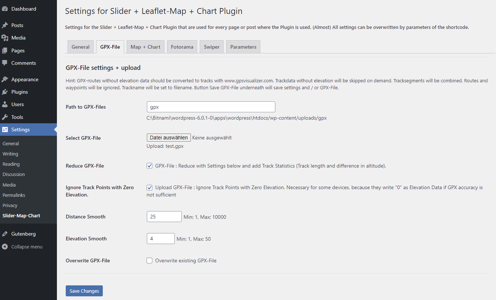
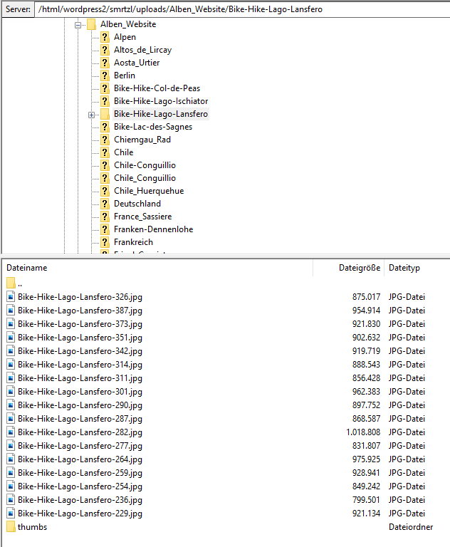

# Contents

- [Description](#description)
- [Donate](#donate)
- [Live Example or Demo](#live-example-or-demo)
- [Note prior to installation](#note-prior-to-installation)
- [Installation](#installation)
- [Update or De-Installation](#update-or-de-installation)
- [Upgrade Notice](#upgrade-notice)
- [Usage](#usage)
- [Image Preparation and Usage of the Fotorama-Slider](#image-preparation-and-usage-of-the-fotorama-slider)
- [Usage of Leaflet Elevation](#usage-of-leaflet-elevation)
- [Frequently Asked Questions](#frequently-asked-questions)
- [Translation, i18n](#translation--i18n)
  * [Frontend](#frontend)
  * [Backend](#backend)
- [Credits](#credits)
- [Note for Developers](#note-for-developers)
- [Changelog](#changelog)

# Description 

Wordpress-Plugin to show a responsive image-slider with JPG- or WEBP-images located in a seperate FOLDER on your server. A thumbnail bar could be shown under the image slider. The images are taken from a folder in the Wordpress upload-directory. Fotorama is used for the slider and the useful settings are available. The slider works only with JPG- or WEBP-Files an not with videos.

Optionally a Leaflet map is shown. This map shows the GPS-position of the images and additionally a GPX-Track that was recorded during the excursion (leaflet elevation is used for that). The map moves synchronously to the slider, e.g. it is centered to the GPS-Position of the currently shown image. Under the map a height-chart of the GPX-track with its statistics is shown. The image slider may be used more than once per page. 

The Plugin is fully responsive (lazy loading) and SEO-friendly. It adds the images optionally to the Yoast-XML-Sitemap and sets the alt-tag of the images. It is possible to use either the image-slider or the map with height-chart alone. Or the map alone with a simple marker. An Image zoom is provided in fullscreen mode (desktops only). It is deactivated for mobile devices.

If resized images and thumbnails are available in the folder, the responsive image srcset is used. If the images were added to WP-Media-Library the Wordpress-information of the Media-Library is used for the title and the alt-tag.  

The Plugin sets additionally the custom-fields 'lon' and 'lat' of the post where the slider is ues. This are the longitude and latitude of the first image or track-point. This coordinates are used by another plugin from me to show all posts in a map. See here: https://github.com/MartinvonBerg/wp_post_map_view_simple. Additionally it sets the start address of the excursion in a custom field an shows under the map with a link to google-maps to retrieve the route to the starting point. Attention: The server-setting 'allow_url_fopen' has to be 'ON' for this to work.

The Admin panel gives an overview of all shortcode parameters and allow to set them globally. Settings that have to be set individually for each slider are not provided in the Admin panel. The admin panel provides also an upload section for gpx-files with additionally size and point reduction and statistics calculation.
Up to now, there is no Gutenberg-Block provided.  **It runs with Wordpress 5.8 and PHP 7.2 - 8.0.1**

</br>   

# Donate
If you like this plugin buy me a coffee or a beer:

[](https://www.paypal.com/cgi-bin/webscr?cmd=_s-xclick&hosted_button_id=CQA6XZ7LUMBJQ)

</br>    

# Live Example or Demo
See under https://www.mvb1.de/skitour-schneibstein/

## Screenshot


# Note prior to installation
The Plugin works together with "Asset Clean up" (https://wordpress.org/plugins/wp-asset-clean-up/ ). 
- I did not test other Plugins for Code-Optimization like Autooptimize or anything else. 
- The plugin was tested with wordpress versions 5.6 - 5.8.0 and PHP 7.4.2 - 8.0.1
- The plugin was tested with other Plugins using leaflet Map:
- It works together with:
    - Leaflet Map (uses the same script-handle 'leaflet_js')
    - Geo Mashup
    - Google Maps Easy
- It causes Javascript-Errors in browser with:    	
    - GEO my Wordpress 
    - MapPress Maps for WordPress
    - Leaflet Maps Marker 	 
    - Ultimate Maps by Supsystic  
    - WP GPX maps	

The new "Plugin-Checker" shows you an error message if one of the above plugins is used together with fotorama_multi.

# Installation

0. Do a complete Back-up of your Wordpress-Site including SQL-Database!
1. **! Important !** Download the plugin as **Release** from github to a local *.zip - file.
2. Install the zipped Plugin to the Wordpress-Plugin-Page (Upload zip in Admin-Backend). 
3. Activate the plugin through the 'Plugins' menu in Admin-Area of WordPress
4. The Admin settings are initialised with reasonable values. Change the settings in the "Fotorama-Elevatione" page for preferred settings.
5. Done!

# Update or De-Installation

1. Deactivate the plugin in Admin-Area of WordPress.
2. Optional for clean Update: Delete the Plugin-in. Stop here for De-Installation. Hint: The Wordpress-Database is cleaned upon de-installation. The Custom-Fields ( the admin settings, only!) are removed from your database! 
3. Do Installation with the new version. Wordpress will provide you a message window wether you are sure. If you de-installed before, all settings have to be done again. Skip Step 2. and you don't have to do that.

# Upgrade Notice 

Upgrade to Wordpress 5.8.0 and PHP 7.4+ is highly recommended!
Due to the error corrections it is highly recommended to upgrade the Plugin! Thank's for your patience.

</br>

# Usage

- Image and GPX-track preparation: see below
- Shortcode:  `[gpxview]`   **Use the code as often you want per page or post! No interference between shortcodes.**
- Parameter usage: <em>Parameter="Value"</em>. See the table below for shortcode parameters. Separate by at least one space in between the different parameters.


|Shortcode|Value (Default first)|Example|Description|
|:--------|:--------------------|:------|:----------|
|gpxpath|gpx|gpxpath="gpx"|Path to file(s) with GPX-Track(s) relative to the WordPress upload folder, e.g: ../wordpress/wp-content/uploads/gpx. Do not use trailing slashes!|
|gpxfile|test.gpx|gpxfile="test.gpx"|File with gpx-track, e.g: ../wordpress/wp-content/uploads/gpx/test.gpx. Use a comma separated list for multiple files: "f1.gpx, f2.gpx, f3.gpx" (The file name given in the GPX-section of the admin settings is NOT shown in the example shortcode!)|
|dload|yes / no|dload="yes"|Provide download link for the GPX-Track(s), if set to "yes".|
|showalltracks|false / true|showalltracks="true"|Show all given tracks together in one Map. Works only with one map per page! Will be ignored for multiple maps or if only one track is provided. There is no admin-setting for this option as this is no useful global option.|
|showadress|true / false|showadress="true"|Show start address of the tour. GPX-coords are taken from the the custom fields *lat* and *lon*. Field is translation ready if its value is 'start address'. Only shown if the custom field 'geoadress' is set. The adresstext is linked to the google-map-service which opens in a separate tab of the browser. **Attention: The server-setting 'allow_url_fopen' has to be 'ON' for this to work ! The plugin gives you a message instead of the Start Address if you are logged in as Admin.**
|adresstext|Start address|adresstext="Start address"|Text before the start address. Field is translation ready if its value is 'Start address'. Mind that translation may not show up if any cache is used! Even the browser cache will block the translation to show up.|
|showmap|true / false|showmap="true"|Show the map, independent of other settings. There is no admin-setting for this option as this is no useful global option.|
|mapheight|450|mapheight="450"|Height of the leaflet map in pixels (px). Note that this value maybe overwritten be the responsive function! Could happen that you won't see any change in the frontend if you change this value by the Admin settings.|
|chartheight|200|chartheight="200"|Height of the leaflet elevation chart in pixels (px)|
|eletheme|lime-theme|eletheme="lime-theme"|Theme for leaflet elevation. Other themes are: steelblue-theme, purple-theme, yellow-theme, red-theme, magenta-theme, lightblue-theme and martin-theme. And Martin-theme is my special theme.|
|mapcenter|0.0,0.0|mapcenter="48.12,12.35"|Center of the map if NO tracks and images are used. Usa comma "," for separation and dot "." for decimals. There is no admin-setting for this option. This is for a simple map with a marker showing some text on hover.|
|zoom|8|zoom="8"|Zoom level for the map if NO tracks and images are used. There is no admin-setting for this option. This is for a simple map with a marker showing some text on hover.|
|markertext|Home Address|markertext="My Address"|Tooltip text for the marker that is shown at mouse over. There is no admin-setting for this option. This is for a simple map with a marker showing some text on hover.|
|**Fotorama**||||
|imgpath|Bilder|imgpath="Bilder"|Path the images relative to the Wordpress upload folder, e.g: ../wordpress/wp-content/uploads/galleries/holiday2020. Do not use trailing slashes!|
|alttext|''|alttext="Image Slider with map from holiday"|Alt-text for the fotorama slider for SEO|
|ignoresort|false / true|ignoresort="false"|Ignore custom sort even if provided by Wordpress. If checked (="true") sort by image-taken-date ascending. The custom sort is only provided if the images were added to a separate folder of WP Media library and the custom field "gallery_sort" was set! This setting may be done with the WP REST API, see also: https://github.com/MartinvonBerg/Ext_REST_Media_Lib|
|requiregps|true / false|requiregps="true"|Require images to have GPS-data in EXIF. Show image only if it provides GPS-Data in its EXIF. Or show images also if the do NOT provide GPS-data.|
|maxwidth|600|maxwidth="600"|Maximum width of the whole container with slider and map. Mind that the max. width of the outer div may be inherited from other elements or set by the theme.|
|minrowwidth|480|minrowwidth="480"|Minimum width of one row of the CSS-Grid. If greater than the half of the above maxwidth the Fotorama slider and the map are never shown in one row. Mind that the max. width of the outer div may be inherited from other elements or set by the theme.|
|showcaption|true / false|showcaption="true"|Show the caption in the fotorama slider or not. Does not work perfectly if set to "false".|
|useCDN|false / true|useCDN="false"|Use CDN for js- and css-Library-Files or not.|
| fit |contain , cover, scaledown, none |fit="contain"| Define the scaling of Fotos for the Fotorama Slider.|
| ratio | 1.5 | ratio="1.0" | Define the width / height ratio of the Fotorama slider. Smaller ratio means greater height of the Slider. No checking of values up to now.|
| background | darkgrey | background="red" | Background color of the slider defined by a valid CSS name.|
| navposition | bottom , top | navposition="top" | Position of the navigation bar.|
| navwidth | 100% | navwidth="80%" | Width of the navigation bar in percent. Provide the '%' also!|
| f_thumbwidth | 100 | f_thumbwidth="80" | Width of the single thumbnail in the navigation bar in pixels.|
| f_thumbheight | 75 | f_thumbheight="80" | Height of the single thumbnail in the navigation bar in pixels.|
| thumbmargin | 2 | thumbmargin="3" | Margin between thumbnails in pixels.|
| thumbborderwidth | 2 | thumbborderwidth="3" | Width of the coloured thumbnail border in pixels.|
| thumbbordercolor | #ea0000 | thumbbordercolor="blue" | Color of thumbnail border in CSS name or HEX-value with #!. Attention: If there are multiple shortcodes on the page, the color of the LAST shortcode on the page will be taken.| 
| transition | crossfade , slide , dissolve | transition="slide" | Type of transition between images. |
| transitionduration | 400 | transitionduration="200" | Duration of transition in ms |
| loop | true , false | loop="false" | Loop through images (proceed with first once the reached the las) true or fals.|e
| autoplay | 3000 | autoplay="false" | Autoplay or loop the slider. On with "true" or any numeric interval in milliseconds. Of with "false".|
| arrows | true , false , always | arrows="false" | Show arrows for the slider control. 'always' : Do not hide controls on hover or tap.|

</br>

- Example Shortcode: `[gpxview imgpath="Alben_Website" gpxpath="gpx" gpxfile="test.gpx" showalltracks="false" mapheight="400" chartheight="200" dload="true" alttext="" ignoresort="false" useCDN="false" showadress="true" showmap="true" adresstext="Start address" requiregps="true" maxwidth="1500" minrowwidth="480" showcaption="true" eletheme="lime-theme" mapcenter="48.12,12.35" zoom="8" markertext="My Address"]`

- **ATTENTION** There are Admin Settings without parameter in the shortcode:
    - Set Custom Fields for post: Set Custom Fields (geoadress, lat, lon, postimg) in post. Geoadress is for the start address shown under the elevation chart. Lat.,Lon. are for the GPS-Coords used for the Overview-Map. The custom-fields *lat*, *Lon*, *postimg* and *geoadress* are only set ONCE at the status-transition from 'draft' to 'published' only. So, if you want to change do 'published' to 'draft' to 'published' again. The data is taken from the FIRST shortcode on the page or post, only. So the images have to provide GPS-data or a GPX-track has to be used for this FIRST shortcode.
    - Generate Entries in Yoast XML-Sitemap for Fotorama Images: Generate the Entries for the Yoast XML-Sitemap with the images shown in the Fotorama-Slider. Used for SEO. Entries are stored in Custom field `postimg`. Tested with several fotorama sliders per post! The custom field is only written if `Set Custom Fields` is checked (="true") and if the admin user is logged in. The status change is no longer required. Only usefull if you use Yoast SEO plugin. 
    

- **ATTENTION** And there are shortcode parameters without Admin Settings: see the table above.

</br>

## Usage of the admin section 'GPX-File upload'

### Explanation in the order of appearance:
- GPX-File: Select a GPX-File from your disk you want to upload. The GPX-Path `gpxpath` of the Settings panel is used as folder for storage on the server.
- GPX-Parsing: If checked the file will be reduced to the absolute minimum that is necessary to show a track in the leaflet map. Useful to reduce network load and speed up the page.
- Distance Smooth: Add the track point only if it is XX meters away from the last track point (here 25m).
- Elevation Smooth: Min. Elevation between Track-Points in Meters. Used in Statistics Calc only. Best is 4.
- Overwrite GPX-Track: Well, self explanatory.
- Button "Save GPX-File" : Save the settings GPX-File upload and / or the file itself! 

Process and save the file with the Button at the bottom.

</br>

# Image Preparation and Usage of the Fotorama-Slider 
1. Preparation of Images (optional)
    - Generate Thumbnails and rescale your Images.
    I used "ImageResizer for Windows" rescaled the former full-size images and generated thumbnails. The Thumbnails have to have '_thumb', '-thumb', '200x150' or '150x150' in their filename (e.g. image1-thumb.jpg). The minimum size should be 64 x 64px. Best is 150 x 150px.
    Optionally you can store the Thumbnails to a subfolder './thumbs' but that is not required.
    If you do not provide thumbnails the full-scaled images will be used. This will increase load time significantly.

2. Convert JPGs to WEBPs (optional) 
    To drastically reduce disk-space and download times you may use webp files. I do that converson locally on my computer and do NOT used WP for that. I use Imagemagick for that with the following powershell commands:

    ```bat
    $files = Get-ChildItem ./*.jpg
    foreach ($f in $files) { magick ($f.BaseName + ".jpg") -quality 50 -define webp:auto-filter:true ($f.BaseName + ".webp") }
    ```

    Although the quality is set to 50 percent I can't see any significant difference.

    **Note:** Currently (as of 2021-07-17) WP does NOT extract metadata from WEBP-images. So, currently the most effective way to handle WEBP-images is to upload them as JPEGs and let WP convert all subsizes to *.webp. That could be done with the following code in your `functions.php`:

    ```php
    add_filter( 'image_editor_output_format', function( $formats ) {
	    $formats[ 'image/jpeg' ] = 'image/webp';
	    return $formats;
	    } 
    );
    ``` 

3. Upload images with ftp (FileZilla) or even Lightroom!
    - Upload the images from Step 1 to your Wordpress site e.g. with Filezilla. Upload to the Sub-Folder `imgpath` (see table above) to 
./wp-content/uploads/. `imgpath` could be any allowed folder name. Do not use the WP-standard folders, like ./wp-content/uploads/2020/12 or so.
        - Example:  ./wp-content/uploads/All_Albums/gallery1
    - Do not use 'thumb' or something like '4x5' or 200x150 or 150x150 (used regex: [0-9]x[0-9]) in the filename for the full-sized image. These files will be regarded as thumbnail and therefore ignored for the slider.
    
    Optionally:
    - Add the images to the WordPress Media Library with my other plugin: https://wordpress.org/plugins/wp-wpcat-json-rest/ See there for the manual how to do that.

    - If the images were 
        - added to the Media-Catalog of WordPress or added together with thumbnails (see above) the 'srcset' is used for thumbnails.
        - Note: Only with 'srcset' the small icon on the leaflet map shows the thumb for the image on hover.
        - Note for Lightroom-Users: I also wrote a Lightroom-Plugin to upload the images directly to the Wordpress-Catalog and do the whole process in one Click! All image-work, updates, change of title, development can be done in Lightroom and the same image with unchanged Wordpress-ID is updated. The images in the fotorama-slider are updated automatically. Mind that ALL caches on the line from the server to your browser have to emptied for that. If you use a Plugin to convert jpg to webp the cache of this plugins must be emptied to show changed images in the slider. 
    - Example-Folder

        

4. Add the shortcode to your page or post (see above for the shortcode)

    If EXIF-Data for the caption is not provided it will be replaced by "--"   

5. Further Fotorama Options

    The CSS is set in 'fotorama_multi.css' and 'fotorama3.css'. Further Fotorama-options are to find under : https://fotorama.io/docs/4/options/ or in fotorama.dev.js starting at line 880 under "OPTIONS = {..."

    If you know what you do you migth change the code or CSS to whatever you like. Have fun!
    
5. TODO & Bugs w.r.t to FOTORAMA
    - showcaption: Setting is ignored for the firs two images
    - mixture of images with and without GPS-data and the option showmap="true" and requiregps="false" causes JS-errors. No standard use case. User should set showmap="false" for that case.
    - for images without thumbnail the hover on the map is wrong, pointing to a non existing image.

# Usage of Leaflet Elevation    
1. Preparation  (optional)

    Resize the GPX-Tracks with GPSBabel in a Batch-File (Windows-code):
    ```bat
    FOR %%i In (*.gpx) do GPSBabel -i gpx -f %%~i -x simplify,count=100 -o GPX -F %%~ni.gpx 
    ```
    The number of trackpoints is set by count (My File: GPS_Babel_GPX_Reducet.bat)
    

2. Upload GPX-Tracks
    - Upload the Tracks to the folder  ./wp-content/uploads/gpx with ftp. 
    - Or upload with the admin panel of fotorama-multi as described above.
    - The Folder "gpx" can be chosen relative to "../wp-content/uploads/" with the parameter [gpxview ...gpxpath="*path-to-gpx*"]. 
         Do not use (Back)-Slashes ('/' or '\\')  at the beginning or end of *path-to-gpx*.

3. Activate the map including the track
    - Add the parameter to the Shortcode : [gpxview gpxfile="*Trackname.gpx*"].   Default: "test.gpx".
    - Without the parameter for the folder the standard-folder ./wp-content/uploads/gpx/ is used if not set at the Admin panel.
    - It is possible to show more than one GPX-Track. Provide these by a comma separated list, e.g: gpxfile="Malle.gpx, Malle2.gpx, Malle3.gpx"
    - It is necessary to provide the track-file with the *.gpx extension always.
   

5. TODOs & Bugs 
      - Update leaflet elevation to the current version using current d3.js. 

3. Combination of Image-Slider and OpenStreetMap (the intended use of the plugin):
    - Very simple: combine the above mentioned paramaters in ONE shortcode
    - The plugin sets the custom-fields *lat*, *Lon* and *postimg* at the status-transition from 'draft' to 'published' only. Not before. 	


# Frequently Asked Questions

- Why is the Start address not shown? 
    - Check whether the custom fields *lat*, *lon*, *geoadress* are set. Use the WordPress-Plugin https://www.advancedcustomfields.com/ for that. **Important:** The server-setting *allow_url_fopen* has to be *ON* or *'1'* for that! The plugin give you a message instead of the Start Address if you are logged in as Admin. 

# Translation, i18n
## Frontend
All (available) strings are translated from English to German, Italian, French and Spanish. 'Available' means that some tooltips of leaflet-map are not translatable. You may find the translation in the file 'fotorama_multi.js' in the function `setlang()`. Change it or add your language, if you like so. To add your language just add another array like this:
```JS
let it = {
                'Show all' : "Mostra Tutti",
                'Distance' : "Distanza",
                "Ascent"   : "Salita",
                "Descent"  : "Discesa",
                "Altitude" : "Altitudine", // is in file /src/altitude.js
                "Images"   : "Foto",
                'Show fullscreen' : 'Mappa a schermo intero',
                'Exit fullscreen' : 'Esci schermo intero',
            };
```
Choose you language as array-name similar to `it` here. Mind that you have to 'activate' your translation in that line of code:
```JS
if ( (lang == 'de') || (lang == 'it') || (lang == 'fr') || (lang == 'es') ) {
```
The language setting is done in the browser of the client. So, there are no *.po or *.mo files.
I also provided a translation for the PHP-strings 'Start address' and 'Download' underneath the map. Unfortunately, I realized too late, that this is useless if the page is cached. 

## Backend
The translation of the backend was started partially only. A small part of the GPX-section is translated to german. The remainder not! That's quite a work. 

</br>

# Credits 
This plugin uses the great work from:

- fotorama, see: https://fotorama.io/ Thank you for that!
- leaflet: https://leafletjs.com
- Leaflet-elevation: https://github.com/Raruto/leaflet-elevation Thank you Raruto for your help!
- leaflet.Control.Fullscreen: https://github.com/brunob/leaflet.fullscreen
- leaflet gesture handling: https://github.com/elmarquis/Leaflet.GestureHandling/
- leaflet markercluster: https://github.com/Leaflet/Leaflet.markercluster
- d3.js: https://github.com/d3/d3
- extended ui: Copyright (c) 2020, GPL-3.0+ Project, Gérald Niel, Raruto
- gpx.js: Copyright (C) 2011-2012 Pavel Shramov, Copyright (C) 2013-2017 Maxime Petazzoni <maxime.petazzoni@bulix.org>
- wordpress for coding hints: https://de.wordpress.org/
- jquery.zoom.js from: http://www.jacklmoore.com/zoom
- phpGPX library: https://github.com/Sibyx/phpGPX
- HTML Table generator: https://www.tablesgenerator.com/html_tables
- WordPress Option Page generator from http://jeremyhixon.com/wp-tools/option-page/
- icons from freeicons.io
- https://onlinepngtools.com/ for adaptation of the PNG-icons
- OpenStreetMaps, OpentTopoMaps  are great services.
- Nominatim for reverse geo-coding: https://nominatim.org/release-docs/develop/api/Reverse/
- MediaWiki for the PHP-Code to extract EXIF-Meta from Webp images (https://doc.wikimedia.org/mediawiki-core/1.27.3/php/WebP_8php_source.html)

# Note for Developers
- unit tests
    - No unit testing done at all. I know these are a must for professional software development. But, this is a hobbyist project that I did just for fun. 
- integration tests
    - done on my local test suite and on my live site 
- system tests
    - done on my local test suite and on my live site
    - I'm using an external Python script with selenium to "click" through all pages and posts, capture all error messages and warnings, do screen shots and compare these automatically with previous versions and compare  html-sources with previous sources. Quite useful a automated test to detect hidden errors.
    - interference with other plugins:
        - All PHP code runs in separate namespaces
        - JS is wrapped in a self invoking function call and only executed if the dedicated div-id is found on the page.
        - CSS might be a problem, as I did not us SCSS, CASS or less to generate really separated CSS-classes.
        - I'm using the following plugins in my site: (output of the REST-API to list all plugins)
        ```JSON
        [
            {"name":"Admin Columns"}, 
            {"name":"Antispam Bee"},
            {"name":"Asset CleanUp: Page Speed Booster"}, // This is extensively used to unload unused plugin code!
            {"name":"Cache Enabler"},
            {"name":"Duplicate Page and Post"},
            {"name":"Easy Table of Contents"},
            {"name":"Ext_REST_Media_Lib"}, // Plugin from me
            {"name":"Fotorama-Multi"}, // Plugin from me
            {"name":"Gmedia Gallery"},
            {"name":"Gutenberg"},
            {"name":"WebP Express"},
            {"name":"wp-front-albums"}, // Plugin from me
            {"name":"wp-recent-post-slider"}, // Plugin from me
            {"name":"wp-special-functions"}, // Plugin from me
            {"name":"wp_post_map_view_simple"}, // Plugin from me
            {"name":"Yoast SEO"}
        ]
        ```

- WP coding guidelines
    - Following WP coding guidelines is essential. I realized this too late, so I coded different. The WP code linter shows hundreds of error messages. Coding guidelines have to be used from the beginning of the project.  
- PHP-check with phpcs in Visual Studio Code:
    ``` 
    phpcs -n -p . --standard=PHPCompatibility --runtime-set testVersion 7.0-
    ```
- jquery migrate was used to update fotorama to the jquery version 3.5.1 that is currently used by WordPress. Some js code raises the "add passive event listener warning" which doesn't interfere the execution.
- leaflet-elevation and d3.js: I only managed to have leaflet-elevation running with V5.x of d3.js and not with 6.x. This causes too many error messages. Hopefully raruto will fix that in a later version of leaflet-elevation. Hi did so now, but my code is not compatible. So, I keep d3.js with version V5.16.0.

# Changelog

= 0.4.1 =
07.11.2021: sorting of images back to the main php file. Did not work if added to the class.

= 0.4.0 =
26.10.2021: Start of Code Refactoring and Performance Optimization. Introduced a Class for the read-out out the gallery-folder. Time reduced by 20% from the request time. 
Update of Readme after Performance Optimization.

= 0.3.6 =
04.10.2021: update of http-request-method to WP standard functions in fm_functions.php. Therefore the 'user_agent' in http-header is now the standard header from WP to consistent with certificates (hopefully)

= 0.3.5 =
29.07.2021: Bug-Fix for GPS-data extraction from Webp-Files with inconsistent GPS-Data in extractMetadata.php

= 0.3.4 =
21.07.2021: 0.3.3. did not work. So back to the old version.  (rounding of GPS-Values for google link) TODO: With webp-files the srcset is not created correctly by Wordpress. Could be wordpress core or another plugin. So, not a problem of fotorama-multi. Intime a quick fix should be realisable, meaning creating a special *own* srcset.

= 0.3.3 =
21.07.2021: Minor change (rounding of GPS-Values for google link)

= 0.3.2 =
21.07.2021: Major code-rework and removal of Bugfixes. Curly Braces in PHP! Arghh.

= 0.3.1 =
19.07.2021: Bugfixes due to non-standard usecase testing in PHP and JS.

= 0.3.0 =
17.07.2021: Added webp-support in preparation of Wordpress 5.8. Therefore a Metadata Extractor for EXIF and XMP-Data for webp-images was added. The used WP 5.8 test version did not extract metadata from webp at all. 
Minor bugfixes and changes: re-introduced not to use -scaled images. The string "Galeriebild" is now translatable. It is used if no image title is available.

= 0.2.0 =
30.05.2021: Added Fotorama settings from 11.05.21 to the Admin Panel. Prepared translation for the whole Admin Panel settings. Translation Files will be updated later, they are currently deactivated.

= 0.1.5 =
09.05.2021: js-change to load WordPress-images with srcset and portrait-mode correctly

11.05.2021: introduced an CSS-option to change the background color of the slides, and several options of fotorama are now changeable with parameters of the shortcode. Currently no admin settings for that. But the default-values are not too bad. Soo, no need to change this here. 

= 0.1.4 =
1.05.2021: PHP error correction for setting of custom-fields lat and lon from gpx-file
6.05.2021: check server-config "allow_url_fopen" and show message if admin is logged instead of geaaddress. 
6.05.2021: Two new fotorama options introduced, "fit" and "ratio" 

= 0.1.3 =
14.04.2021: Loading of scripts and styles changed! Now loaded only if the shortcode is on a page. So it is no longer required to use Asset Clean up for that.

= 0.1.2 =
3.04.2021: Minor php error correction

= 0.1.1 =
30.03.2021: uninstall.php updated, because custom-fields updated
    separate enqueue scripts re-introduced, handles changed, handles synchronized with other plugins, all loaded files updated
    plugin- and script-checker introduced
    condition for custom-fields changed, error correction in fotorama_multi.php
    thumbnail on map for images with thumbs but not in wordpress added
    logic with "hasMap" changed, SEO alt-tag corrected
    rescaling of elevation chart removed, zoom w/o map corrected, fotorama w/o map corrected, readme updated

= 0.1.0 =
    18.03.2021: Icons changed, error correction

= 0.0.9 =
    14.03.2021: Error correction, Readme update

= 0.0.8 =
    First public release: 11.03.2021